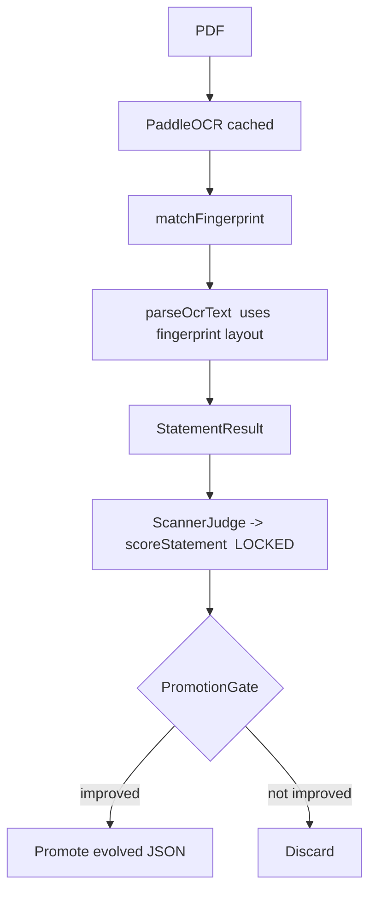

# Bank Statement Scanner (self-improving, no human in the loop)

A self-improving scanner for Australian bank statements built on top of
LoopEngine. The scanner extracts structured data from statement PDFs and uses
LoopEngine's evolution loop to **continuously improve extraction accuracy with
no human in the loop**.

## The core idea

LoopEngine is an outer optimizer that improves an inner function. Here:

- **Inner function** = the scanner (OCR → fingerprint match → parse → score).
- **Outer optimizer** = LoopEngine, which proposes changes, tests them, and
  keeps only what measurably improves the score.

The crucial design decision is **what is allowed to evolve**. Only JSON
artifacts evolve:

- `fingerprints/*.json` — each bank's layout signature (identifiers, column
  positions, date format, etc.).
- `scanner_config.json` — VLM prompts and scoring thresholds.

The scoring, parsing, and consistency code is **locked TypeScript** and is
never placed in the evolvable `source_files` set. This is the anti
reward-hacking guarantee: the loop cannot rewrite the rules it is judged by.

## The scoring signal (label-free)

`src/scanner/scoring.ts` (LOCKED) blends three signals, ordered by how hard
each is to game:

| Signal                | Weight | Why it's trustworthy                                  |
| --------------------- | ------ | ----------------------------------------------------- |
| Balance arithmetic    | 0.5    | `opening + credits − debits ≈ closing` is objective.  |
| Format validity       | 0.3    | BSB shape, parseable dates, numeric amounts.          |
| OCR/VLM consistency   | 0.2    | Tie-breaker only; never the main objective.           |

Because the anchor is balance arithmetic (which you cannot fake with wrong
numbers), the loop cannot win by making OCR and VLM agree on a wrong answer.

## How (and when) a strategy is chosen to evolve

This is the heart of the loop. Each iteration in `LoopEngine.run()`:

1. **MEASURE** — `_run_benchmark()` builds a harness from the current
   `source_files`, runs every task, and scores them with `ScannerJudge`.
2. **PROPOSE** — `_get_proposals()` asks **every** registered
   `EvolutionStrategy` for `CodeMod`s. Each strategy decides for itself whether
   it has anything to contribute by inspecting the current JSON:
   - `FingerprintEvolver` proposes a mod only when a fingerprint is missing
     identifiers, has overlapping columns, lacks a date format, or is
     over-confident for its sample count.
   - `ScannerPromptEvolver` proposes a mod only when a prompt is missing the
     JSON-output requirement, page context, or Australian-bank context.
   - `ScannerConfigEvolver` proposes a mod only when a threshold is
     mis-calibrated or a common date format is missing.

   So "which strategy evolves" is **not** an LLM decision here — it is
   gated by the data: a strategy returns an empty `CodeMod[]` when its
   preconditions are not met, and that strategy is effectively skipped.

3. **TEST + DECIDE** — for each proposed mod, the loop:
   - rejects it up front if `is_safe()` fails,
   - applies its diff (skipping no-op diffs),
   - re-benchmarks the candidate,
   - and lets the `PromotionGate` compare candidate vs. baseline.
4. **PROMOTE** — among all promotable candidates, the **single highest-scoring**
   one is kept; the rest are discarded.
5. **STOP** — the loop stops on max iterations, on `patience` consecutive
   non-promotions, or when no strategy proposes anything.

The decision of *which change to keep* is therefore made by the
**PromotionGate + benchmark score**, not by a model guessing. (When an LLM-backed
strategy is used elsewhere in LoopEngine, the model only *proposes* edits — the
gate still decides what survives.)

## Pipeline



## Modules

| File                        | Role                                              | Locked? |
| --------------------------- | ------------------------------------------------- | ------- |
| `types.ts`                  | Domain types + `DEFAULT_SCANNER_CONFIG`.          | —       |
| `scoring.ts`                | Weighted label-free score.                        | LOCKED  |
| `consistency.ts`            | OCR/VLM cross-validation.                          | LOCKED  |
| `fingerprint.ts`            | Match / create / refine bank fingerprints.        | —       |
| `parser.ts`                 | OCR blocks → structured fields.                   | LOCKED  |
| `cache.ts`                  | Disk cache for OCR (by file) and VLM (by prompt). | —       |
| `evolution_integration.ts`  | `ScannerHarness`, `ScannerJudge`, `ScannerBenchmark`. | — |
| `strategies.ts`             | `FingerprintEvolver`, `ScannerPromptEvolver`, `ScannerConfigEvolver`. | — |
| `runner.ts`                 | `runScannerEvolution()` entry point.              | —       |

"Locked" modules are never added to `source_files`, so the evolution loop
cannot modify them.

## Usage

```ts
import { runScannerEvolution } from "./src/scanner";

const { report, evolved_fingerprints, evolved_config } =
    await runScannerEvolution({
        pdf_paths: ["statement1.pdf", "statement2.pdf"],
        fingerprints_dir: "./fingerprints",
        config_path: "./scanner_config.json",
        max_iterations: 10,
        patience: 3,
        checkpoint_path: "./checkpoint.json",
    });

console.log(report.summary());
```

> **OCR note:** `precomputeOcr()` in `runner.ts` is currently a stub that
> returns empty pages. Real PaddleOCR (Python subprocess) integration is the
> one remaining production hook. All tests mock OCR, and the mocked-OCR E2E
> test (`tests/test_scanner_e2e.test.ts`) demonstrates the full loop improving
> a deliberately-broken fingerprint from ~0.15 to 1.0.

## Tests

```sh
bun test tests/test_scanner_scoring.test.ts \
         tests/test_scanner_fingerprint.test.ts \
         tests/test_scanner_parser.test.ts \
         tests/test_scanner_consistency.test.ts \
         tests/test_scanner_cache.test.ts \
         tests/test_scanner_evolution.test.ts \
         tests/test_scanner_e2e.test.ts \
         tests/test_scanner_runner.test.ts
```

Built with TDD/BDD throughout, with a final code-review pass and an E2E test
that verifies (a) the score strictly improves, (b) the JSON artifacts actually
change, (c) the locked code is never placed in `source_files`, and (d) the
judge scores the real extraction carried through the trajectory.
